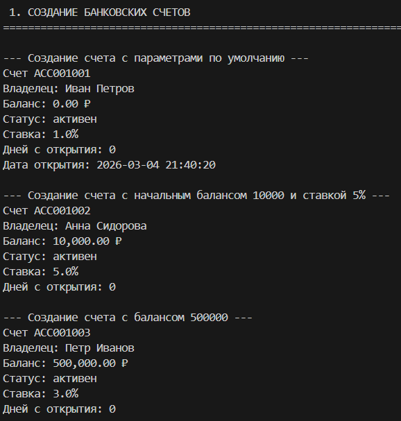
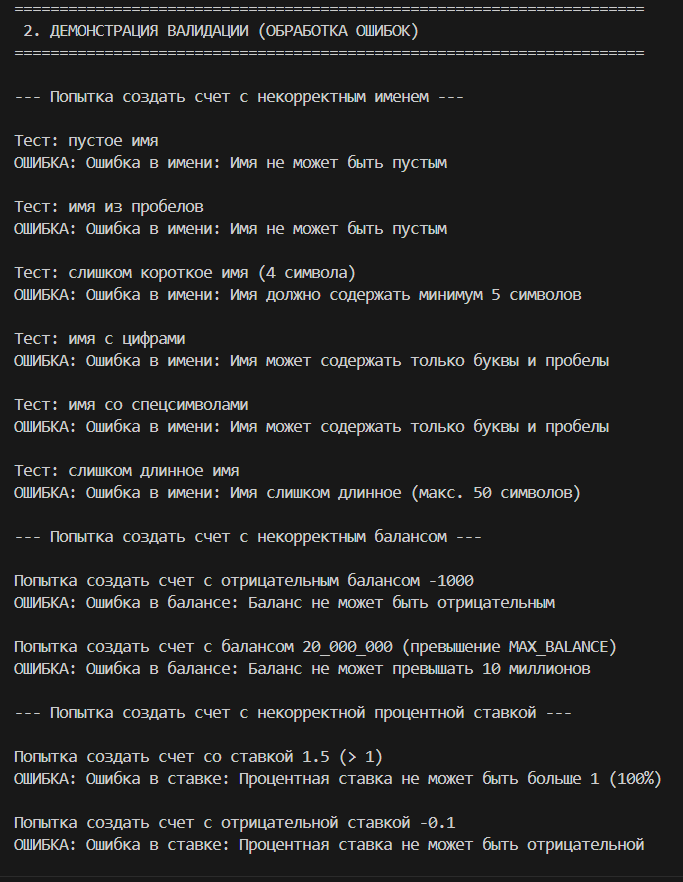
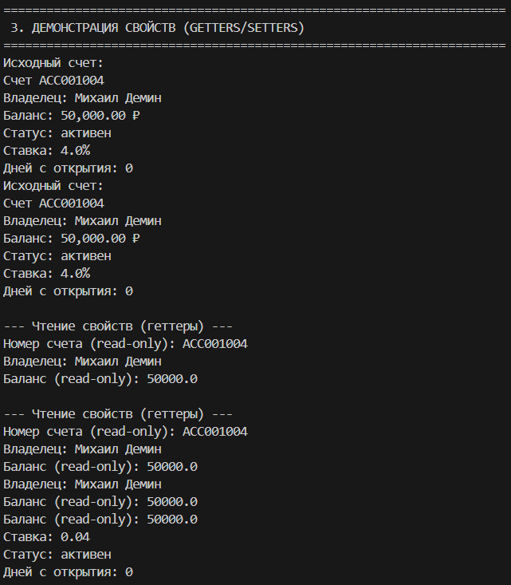
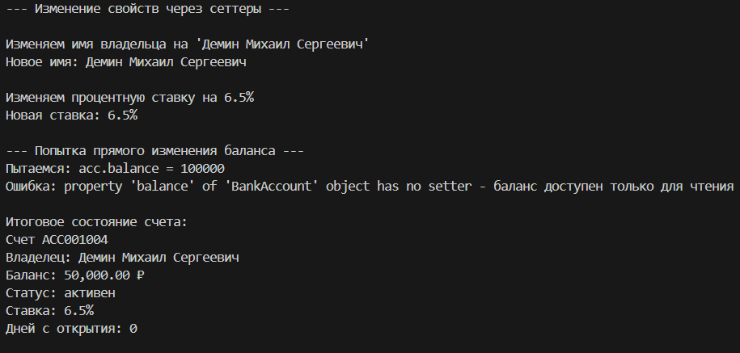
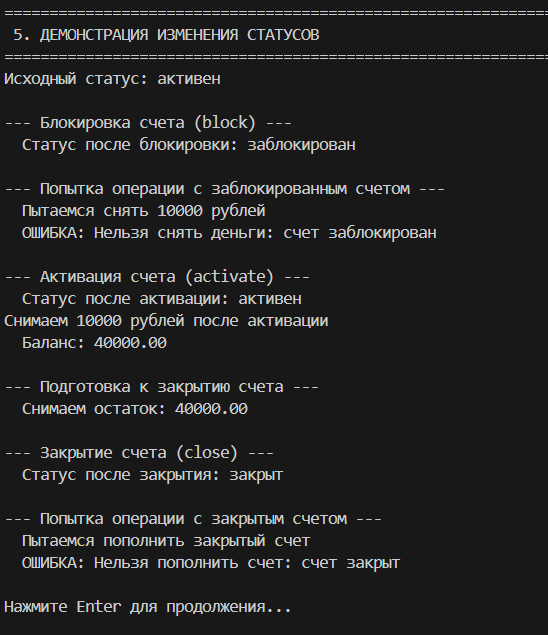
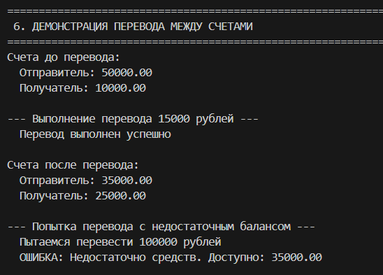
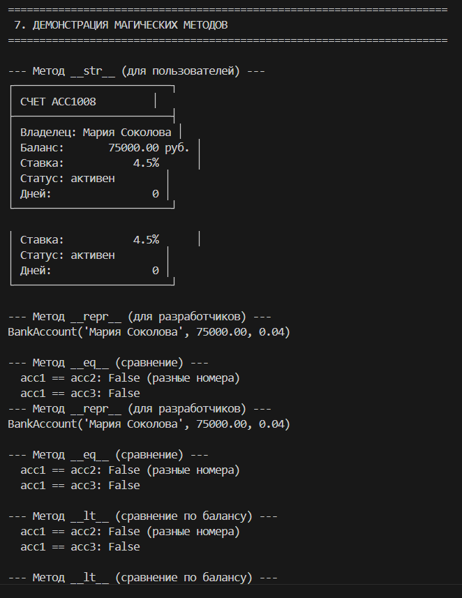
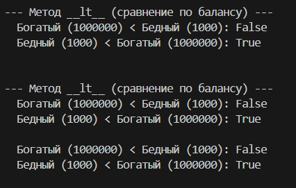

# Лабораторная работа №1: Банковская система 4 вариант

<div align="center">
  
</div>


## Цель работы

- Освоить объявление пользовательских классов
- Разобраться с инкапсуляцией (закрытые поля)
- Реализовать свойства (`@property`)
- Переопределить магические методы (`__str__`, `__repr__`, `__eq__`)
- Понять разницу между атрибутами класса и экземпляра

**Задумка**
Создать "умный" банковский счет, который:

~ Сам следит за корректностью данных (валидация)

~ Запрещает недопустимые операции (снятие больше баланса, действия с заблокированным счетом)

~ Предоставляет удобный интерфейс через свойства (@property))

## Реализованный класс

**BankAccount**
```python
class BankAccount:
    # Атрибуты класса
    BANK_NAME = "Python Bank"
    MIN_BALANCE = 0.0
    MAX_BALANCE = 10_000_000.0
```
Главный класс, моделирующий банковский счет. Содержит всю логику работы со счетом.

**Атрибуты класса:**
- `bank_name` — название банка
- `_next_account_number` — счетчик для генерации номеров счетов

**Закрытые поля:**
- `_owner_name` - имя владельца счета
- `_balance` - баланс счета
- `_interest_rate` - процентная ставка
- `_account_number` — номер счета
- `_status` — статус счета
- `_opening_date` — дата открытия
  
**Свойства @property:**
- Чтение: `account_number` - номер счета
- Чтение: `balance` - баланс счета
- Чтение: `status` - статус счета
- Чтение и запись: `owner_name` - имя владельца
- Чтение и запись: `interest_rate` - процентная ставка
- Вычисляемое: `days_open` — количество дней с открытия счета

**Магические методы:**
- `__str__` — для print (читаемое описание)
- `__repr__` — для разработчиков
- `__eq__` — сравнение по IP-адресу
- `__lt__` - cравнение по балансу

**Бизнес-методы:**
- `deposit(amount)` - пополнение счета
- `withdraw(amount)` - снятие со счета
- `transfer_to(other_account, amount)` - перевод на другой счет

**Сценарий 1: Создание счетов**



• Создание счета с параметрами по умолчанию

• Создание счета с начальным балансом 10000 и ставкой 5%

• Создание счета с балансом 500000

*Показывает, что каждый счет получает свой номер (ACC1000, ACC1001...), а значения по умолчанию применяются корректно.*

**Сценарий 2: Валидация (обработка ошибок)**



• Некорректные имена (пустые, короткие, с цифрами)

• Отрицательный баланс

• Превышение максимального баланса

• Некорректная процентная ставка

*Программа намеренно пытается создать счета с некорректными данными, чтобы продемонстрировать защиту от ошибок.*


**Сценарий 3: Свойства (геттеры/сеттеры)**


• Чтение всех свойств

• Изменение имени владельца

• Изменение процентной ставки

• Попытка изменения баланса (ошибка)

*Демонстрируется, как работать со свойствами класса - читать и изменять данные через специальные методы.*

**Сценарий 4: Банковские операции**



• Внесение средств

• Снятие средств

• Попытка снять больше баланса (ошибка)

• Расчет и начисление процентов

• Некорректные операции (отрицательная сумма, ноль)

*Показать, что все операции проверяются на корректность, и при ошибках счет остается в целостном состоянии.*

**Сценарий 5: Изменение статусов**



•Блокировка счета

• Операция с заблокированным счетом (ошибка)

• Активация счета

• Заморозка счета

• Операция с замороженным счетом (ошибка)

• Снятие всех средств и закрытие счета

• Операция с закрытым счетом (ошибка)
*Прослеживается полный жизненный цикл счета - от создания до закрытия, с демонстрацией как меняется поведение при разных статусах.*

**Сценарий 6: Переводы между счетами**



• Перевод 15000 рублей

• Перевод с недостаточным балансом (ошибка)
*Демонстрируется взаимодействие двух объектов - перевод денег с одного счета на другой.*

**Сценарий 7: Магические методы**




__str__ (пользовательский вывод):
• Создается счет
• Выводится результат print(acc1) 
• На экране появляется красивая табличка с информацией о счете
• Это метод, который вызывается, когда объект нужно показать пользователю

__repr__ (отладочный вывод): 
• Выводится результат repr(acc1)
• Появляется строка типа BankAccount('Мария', 75000.00, 0.01)
• Это представление для отладки,показывающее как создать такой же объект

__eq__ (сравнение счетов):
•Сравниваем два счета с одинаковыми параметрами, но разными номерами.
•Результат: False (считаются разными, так как номера отличаются)
•Сравниваем с совсем другим счетом - тоже False

__lt__ (сравнение по балансу):
•Создаем богатый счет (1000000) и бедный (1000)
•Проверяем: богатый < бедный? → False
•Проверяем: бедный < богатый? → True

Этот метод позволяет сортировать счета по балансу

*Показать, что наши объекты можно выводить, сравнивать и сортировать как встроенные типы Python.*


