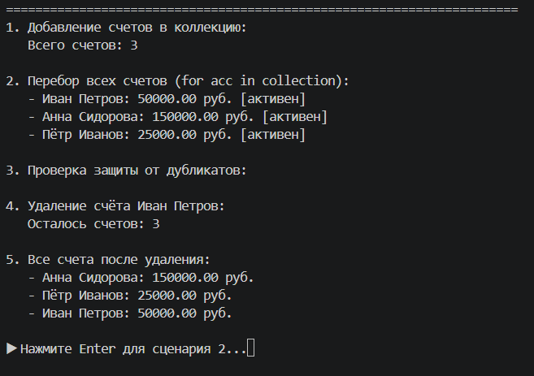
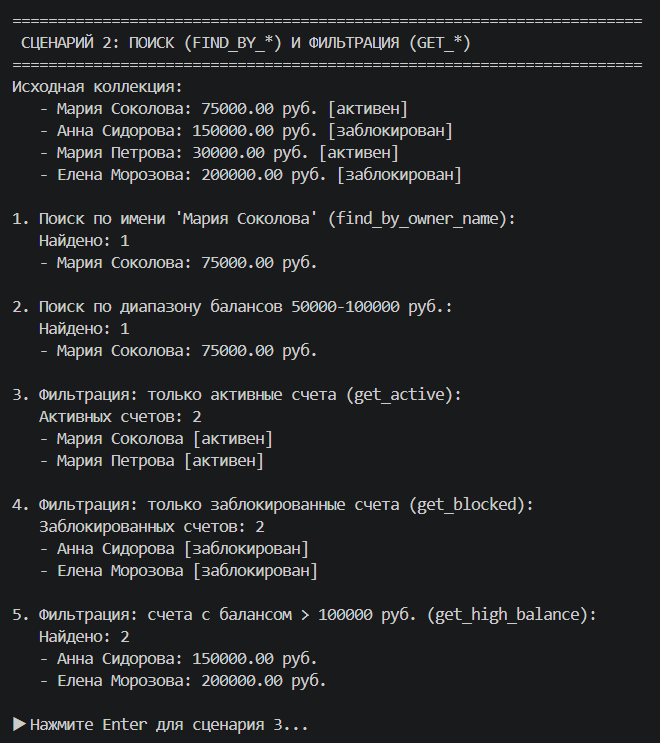
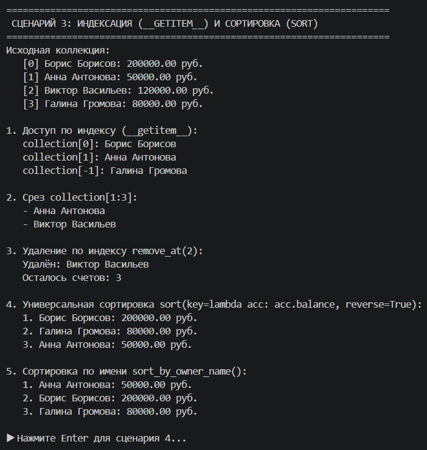
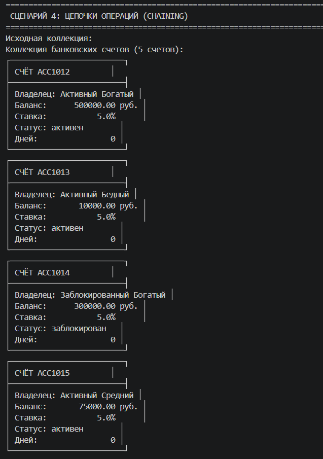
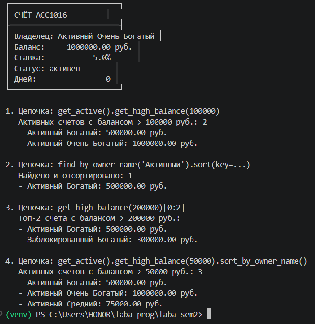

# Лабораторная работа №2: Коллекция объектов (Python)

## Выбранная предметная область

**Банковские счета**

Реализованный класс коллекции: **BankAccountCollection**

Коллекция для хранения и управления объектами `BankAccount` из ЛР-1. Реализует контейнер для группы банковских счетов с возможностью добавления, удаления, поиска, сортировки и фильтрации.

## Краткое описание класса

`BankAccountCollection` — это контейнерный класс для управления коллекцией банковских счетов. Внутри хранит список объектов `BankAccount`.

### Основные возможности

| Функция | Описание |
|---------|----------|
| **Хранение** | Список объектов `BankAccount` |
| **Управление** | Добавление, удаление, доступ по индексу |
| **Поиск** | По имени владельца, диапазону баланса, статусу |
| **Сортировка** | По балансу, имени владельца |
| **Фильтрация** | Получение подколлекций (активные, заблокированные, с высоким балансом) |
| **Итерация** | Поддержка цикла `for` |
| **Защита** | Проверка типа, запрет дубликатов по номеру счёта |

## Методы коллекции

### Базовые операции

| Метод | Описание |
|-------|----------|
| `add(item)` | Добавить банковский счёт |
| `remove(item)` | Удалить банковский счёт |
| `remove_at(index)` | Удалить по индексу |
| `get_all()` | Получить список всех счетов |

### Поиск

| Метод | Описание |
|-------|----------|
| `find_by_owner_name(name)` | Поиск по имени владельца |
| `find_by_balance_range(min, max)` | Поиск по диапазону балансов |
| `find_by_status(status)` | Поиск по статусу |

### Магические методы

| Метод | Описание |
|-------|----------|
| `__len__` | Получение количества счетов |
| `__iter__` | Итерация по коллекции |
| `__getitem__` | Доступ по индексу |
| `__str__` | Строковое представление |

### Сортировка
<<<<<<< HEAD
=======

| Метод | Описание |
|-------|----------|
| `sort_by_balance(reverse)` | Сортировка по балансу |
| `sort_by_owner_name(reverse)` | Сортировка по имени владельца |
| `sort(key, reverse)` | Универсальная сортировка |

### Фильтрация (возвращают новую коллекцию)

| Метод | Описание |
|-------|----------|
| `get_active()` | Активные счета |
| `get_blocked()` | Заблокированные счета |
| `get_high_balance(threshold)` | Счета с балансом выше порога |

## Демонстрация работы (demo.py)

---

### Сценарий 1 — Базовые операции

**Что демонстрируется:**
- создание пустой коллекции
- создание объектов `BankAccount`
- добавление счетов в коллекцию
- вывод всех счетов через итерацию
- удаление счёта
- проверка типа при добавлении
- защита от дубликатов
>>>>>>> 2a1f505f0eae34615266abca0d51516fbe79812a

| Метод | Описание |
|-------|----------|
| `sort_by_balance(reverse)` | Сортировка по балансу |
| `sort_by_owner_name(reverse)` | Сортировка по имени владельца |
| `sort(key, reverse)` | Универсальная сортировка |

<<<<<<< HEAD
### Фильтрация (возвращают новую коллекцию)

| Метод | Описание |
|-------|----------|
| `get_active()` | Активные счета |
| `get_blocked()` | Заблокированные счета |
| `get_high_balance(threshold)` | Счета с балансом выше порога |

## Демонстрация работы (demo.py)

---

### Сценарий 1 — Базовые операции

**Что демонстрируется:**
- создание пустой коллекции
- создание объектов `BankAccount`
- добавление счетов в коллекцию
- вывод всех счетов через итерацию
- удаление счёта
- проверка типа при добавлении
- защита от дубликатов

=======

>>>>>>> 2a1f505f0eae34615266abca0d51516fbe79812a
---

### Сценарий 2 — Поиск и фильтрация

**Что демонстрируется:**
- поиск счёта по имени владельца (`find_by_owner_name`)
- поиск в диапазоне балансов (`find_by_balance_range`)
- фильтрация активных счетов (`get_active`)
- фильтрация заблокированных счетов (`get_blocked`)
- фильтрация счетов с высоким балансом (`get_high_balance`)
- использование `len()` и итерации

---

### Сценарий 3 — Индексация и сортировка

**Что демонстрируется:**
- доступ по индексу через `__getitem__` (`collection[0]`)
- использование срезов (`collection[1:3]`)
- удаление по индексу (`remove_at`)
- универсальная сортировка (`sort(key=lambda acc: acc.balance, reverse=True)`)
- сортировка по имени владельца (`sort_by_owner_name`)

---

### Сценарий 4 — Цепочки операций

**Что демонстрируется:**
- цепочка: `get_active().get_high_balance(100000)` — активные счета с высоким балансом
- цепочка: `find_by_owner_name().sort()` — поиск и сортировка
- цепочка: `get_high_balance(200000)[0:2]` — фильтрация и срез
- цепочка: `get_active().get_high_balance(50000).sort_by_owner_name()` — несколько фильтров подряд
- демонстрация того, что методы возвращают новые коллекции

