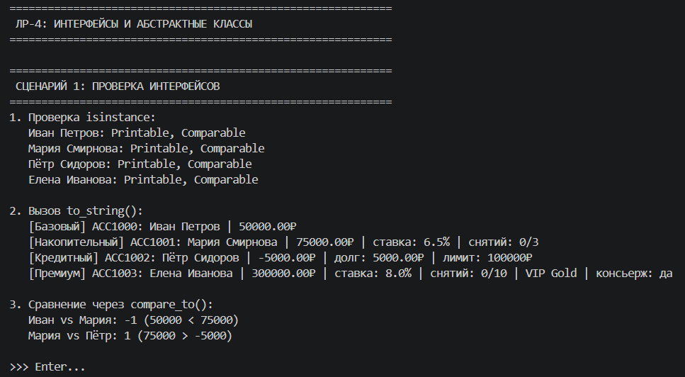
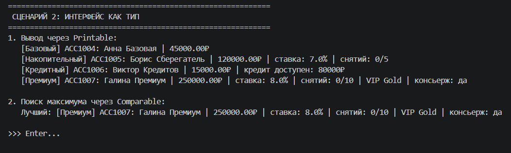
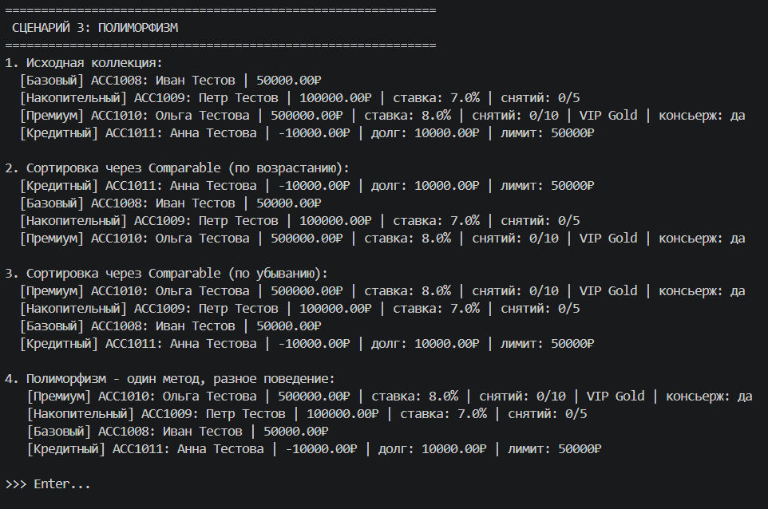
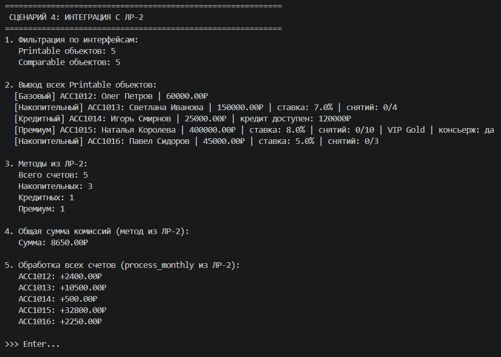
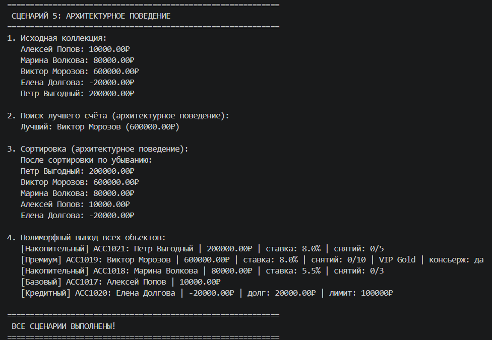

# ЛР-4: Интерфейсы и абстрактные классы

## Цель работы
Изучить:
- Абстрактные классы (ABC)
- Интерфейсы как контракты поведения
- Полиморфизм через интерфейсы

## Созданные интерфейсы

### 1. Printable
Метод `to_string()` - возвращает строковое представление объекта

### 2. Comparable  
Метод `compare_to(other)` - сравнивает объекты:
- `-1` если текущий меньше
- `0` если равны
- `1` если текущий больше

## Реализация в классах

| Класс | Printable | Comparable |
|-------|-----------|------------|
| BankAccount | выводит владельца и баланс | сравнивает по балансу |
| SavingsAccount | добавляет ставку и лимит снятий | сравнивает по ставке |
| CreditAccount | добавляет кредитный лимит | наследует от BankAccount |
| PremiumAccount | добавляет VIP-уровень | сравнивает по VIP, затем по балансу |

## Демонстрация

### Сценарий 1: Проверка интерфейсов

**Что происходит:**
- Создаются 4 объекта разных классов
- Проверка `isinstance(obj, Printable)` - все объекты реализуют интерфейс
- Проверка `isinstance(obj, Comparable)` - все объекты реализуют интерфейс
- Вызов `to_string()` у каждого объекта - у каждого класса свой формат вывода
- Сравнение объектов через `compare_to()` - BankAccount сравнивает по балансу, SavingsAccount по ставке

**Результат:** Видно, что все классы реализуют оба интерфейса и каждый по-своему

---

### Сценарий 2: Интерфейс как тип

**Что происходит:**
- Создаётся коллекция с разными типами счетов
- Функция `print_all(items: list)` принимает список объектов Printable
- Функция `find_max(items: list)` принимает список объектов Comparable
- Обе функции работают с ЛЮБЫМИ классами, реализующими интерфейс

**Результат:** Функции не знают о конкретных классах, только об интерфейсе. Это полиморфизм

---

### Сценарий 3: Полиморфизм

**Что происходит:**
- Создаётся коллекция с разными счетами
- Вывод исходной коллекции через `print_all()`
- Сортировка по возрастанию через `sort_using_comparable()` - каждый класс сравнивается по своему критерию
- Сортировка по убыванию через `sort_using_comparable(reverse=True)`
- Вывод каждого объекта через `to_string()` - один метод, разный результат

**Результат:** В коде сортировки нет ни одного `if isinstance()`, только вызов `compare_to()`

---

### Сценарий 4: Интеграция с ЛР-2

**Что происходит:**
- Создаётся коллекция из 5 счетов разных типов
- `get_printable()` - фильтрация объектов с интерфейсом Printable (все 5)
- `get_comparable()` - фильтрация объектов с интерфейсом Comparable (все 5)
- `print_all()` - вывод всех объектов через интерфейс Printable
- `get_by_type()` - метод из ЛР-2 для фильтрации по классу
- `total_fees()` - метод из ЛР-2 для подсчёта комиссий
- `process_all()` - метод из ЛР-2 для обработки всех счетов

**Результат:** Интерфейсы отлично работают вместе с методами из ЛР-2

---

### Сценарий 5: Архитектурное поведение

**Что происходит:**
- Создаётся коллекция с разными балансами и VIP-уровнями
- Вывод исходных балансов
- `find_best()` - поиск лучшего счёта через `compare_to()` (PremiumAccount сравнивается по VIP-уровню)
- `sort_using_comparable()` - сортировка всей коллекции
- Полиморфный вывод всех объектов через `to_string()`

**Результат:** Архитектурные методы (`find_best`, `sort_using_comparable`) работают одинаково для всех классов

## Выводы
1. Интерфейсы задают контракт - какие методы ОБЯЗАН иметь класс
2. Полиморфизм позволяет писать универсальный код для любых классов
3. Не нужно проверять тип через `isinstance()` в циклах
4. Интерфейсы легко интегрируются с существующей коллекцией
5. Архитектурное поведение реализуется один раз для всех классов
