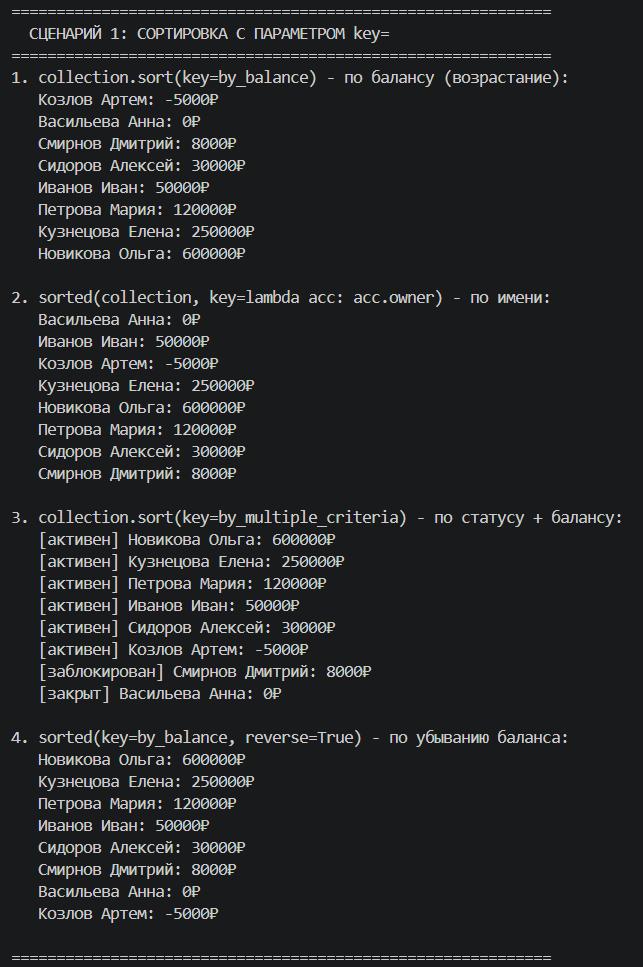
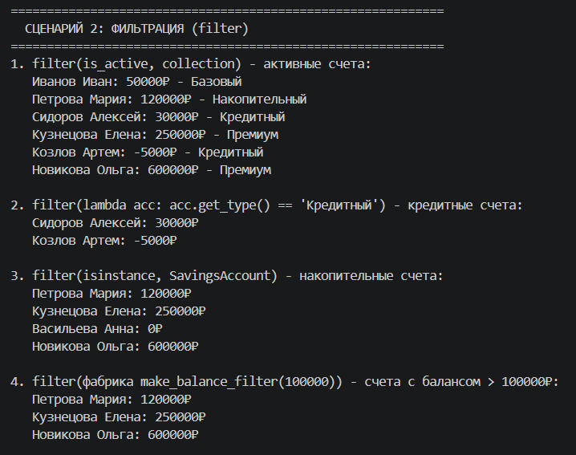
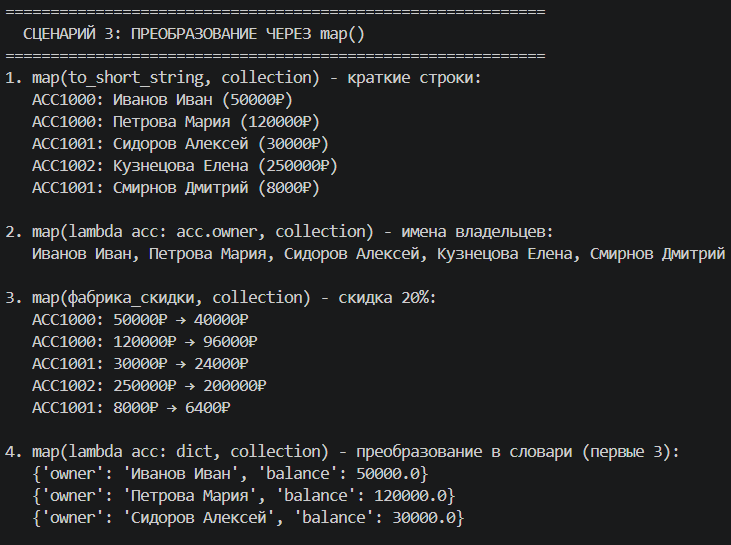
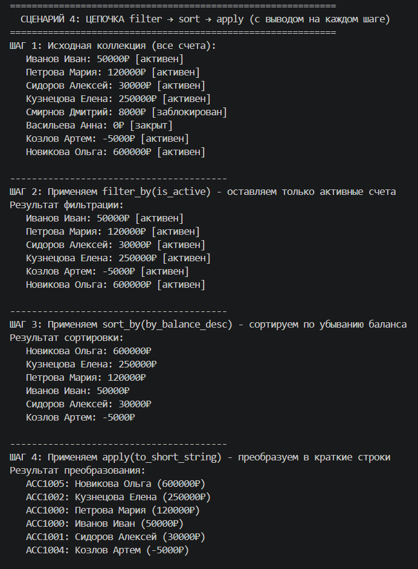
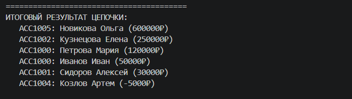
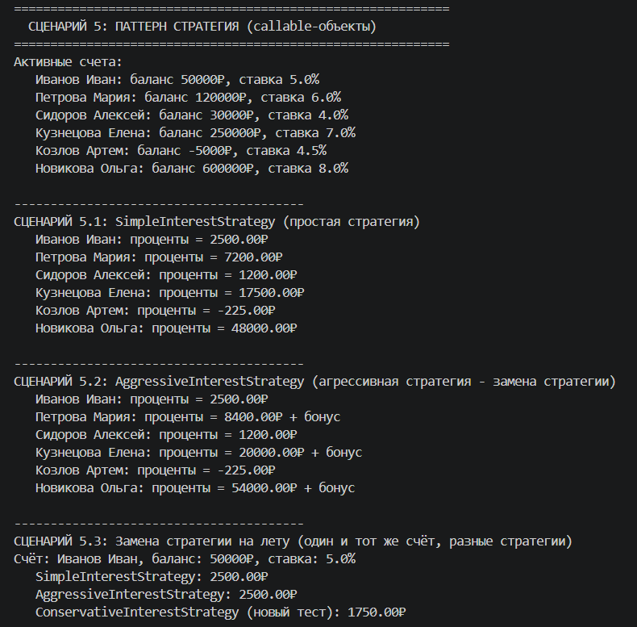
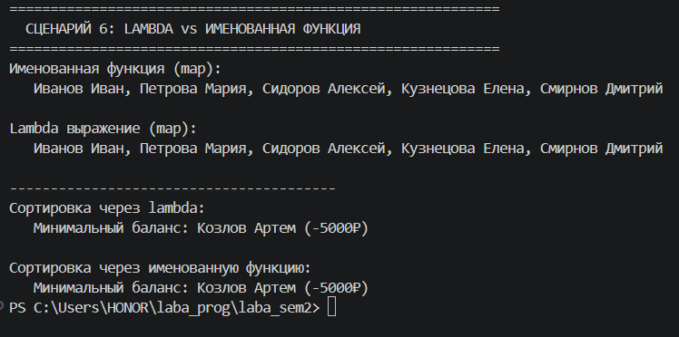

# ЛР-5 — Функции как аргументы. Стратегии и делегаты

## 1. Цель работы

- Освоить передачу функций как аргументов в другие функции и методы
- Научиться применять встроенные функции высшего порядка: `map`, `filter`, `sorted`
- Понять концепцию паттерна «Стратегия» и реализовать его на Python
- Освоить `lambda`-выражения и их практическое применение
- Интегрировать функциональный стиль с объектно-ориентированным кодом из предыдущих ЛР

## 2. Реализованные функции и стратегии

### 2.1. Функции-стратегии для сортировки

| Функция | Описание |
|---------|----------|
| `by_balance` | Сортировка по балансу (возрастание) |
| `by_owner_name` | Сортировка по имени владельца |
| `by_balance_desc` | Сортировка по балансу (убывание) |
| `by_multiple_criteria` | Сортировка по статусу счета + балансу |

### 2.2. Функции-фильтры

| Функция | Описание |
|---------|----------|
| `is_active` | Отбирает только активные счета |
| `is_not_closed` | Отбирает не закрытые счета |
| `make_balance_filter(threshold)` | Фабрика: создает фильтр для счетов с балансом выше порога |

### 2.3. Функции высшего порядка и фабрики

| Функция/Фабрика | Описание |
|----------------|----------|
| `sorted(collection, key=func)` | Встроенная сортировка с пользовательским ключом |
| `filter(predicate, collection)` | Встроенная фильтрация по условию |
| `map(func, collection)` | Встроенное преобразование элементов |
| `make_balance_filter(min, max)` | Фабрика: создает фильтр по диапазону балансов |
| `make_discount_applier(percent)` | Фабрика: создает функцию для применения скидки |

### 2.4. Паттерн «Стратегия» (callable-объекты)

Реализованы три класса стратегий расчёта процентов:

| Стратегия | Описание |
|-----------|----------|
| `SimpleInterestStrategy` | Простая стратегия: проценты = баланс × ставка |
| `AggressiveInterestStrategy` | Агрессивная стратегия: дополнительный бонус для крупных счетов |
| `ConservativeInterestStrategy` | Консервативная стратегия: пониженные проценты или отказ при высоком балансе |

Все стратегии реализованы как callable-объекты (с методом `__call__`), что позволяет:
- Передавать их как обычные функции
- Хранить состояние внутри объекта стратегии
- Легко заменять одну стратегию на другую без изменения кода коллекции

### 2.5. Методы коллекции

В класс `BankAccountCollection` добавлены методы:

| Метод | Описание |
|-------|----------|
| `sort_by(key_func, reverse)` | Сортирует коллекцию по переданной функции-ключу |
| `filter_by(predicate)` | Возвращает новую коллекцию с отфильтрованными элементами |
| `apply(func)` | Применяет функцию к каждому элементу и возвращает список результатов |

## 3. Демонстрация работы

### Сценарий 1: Сортировка с параметром `key=`

**Что демонстрируется:**
- Сортировка с использованием `list.sort(key=...)` и именованной функции
- Сортировка с использованием `sorted()` и lambda-выражения
- Сортировка по нескольким критериям (статус + баланс)
- Сортировка в обратном порядке с параметром `reverse=True`

**Исходные данные:** Коллекция из 8 банковских счетов с разными балансами, статусами и типами.

**Результат:**
- Сортировка по балансу выводит счета от минимального баланса (-5000₽) до максимального (600000₽)
- Сортировка по имени выводит счета в алфавитном порядке владельцев
- Сортировка по статусу показывает сначала активные счета, затем заблокированные, затем закрытые

---

### Сценарий 2: Фильтрация с `filter()`

**Что демонстрируется:**
- Фильтрация с использованием `filter()` и именованной функции `is_active`
- Фильтрация с использованием `filter()` и lambda-выражения
- Фильтрация по типу объекта с помощью `isinstance()`
- Фильтрация через фабрику функций `make_balance_filter()`

**Исходные данные:** Та же коллекция из 8 счетов.

**Результат:**
- Активные счета: 6 счетов
- Кредитные счета: 2 счета (Сидоров Алексей, Козлов Артем)
- Накопительные счета: 2 счета (Петрова Мария, Васильева Анна)
- Счета с балансом > 100000₽: 4 счета

---

### Сценарий 3: Преобразование с `map()`

**Что демонстрируется:**
- Преобразование объектов в краткие строки с помощью `map()`
- Извлечение одного поля (имена владельцев) через `map()` и lambda
- Применение скидки ко всем счетам через фабрику функций
- Преобразование объектов в словари через lambda

**Исходные данные:** Коллекция из 8 счетов.

**Результат:**
- Краткие строки формата: `ACC1000: Иванов Иван (50000₽)`
- Список имен: Иванов Иван, Петрова Мария, Сидоров Алексей, ...
- Скидка 20%: каждый счет показывает исходный и discounted баланс
- Словари: `{"owner": "Иванов Иван", "balance": 50000}`

---

### Сценарий 4: Цепочка операций filter → sort → apply

**Что демонстрируется:**
- Последовательное применение операций к коллекции
- Промежуточные результаты после каждого шага
- Fluent-интерфейс (цепочки вызовов методов)

**Пошаговый вывод:**

**Шаг 1 - Исходная коллекция:**
Показывает все 8 счетов с их балансами и статусами.

**Шаг 2 - После `filter_by(is_active)`:**
Остаются только активные счета (6 счетов). Заблокированный и закрытый счета отфильтрованы.

**Шаг 3 - После `sort_by(by_balance_desc)`:**
Активные счета отсортированы по убыванию баланса. Первым идет Новикова Ольга (600000₽), последним - Козлов Артем (-5000₽).

**Шаг 4 - После `apply(to_short_string)`:**
Каждый счет преобразован в краткую строку.

**Итог:** Полная цепочка успешно выполнена, каждый шаг выведен на экран.

---

### Сценарий 5: Паттерн Стратегия (callable-объекты)

**Что демонстрируется:**
- Работа callable-объекта как стратегии
- Замена стратегии без изменения кода коллекции
- Разные результаты при использовании разных стратегий

**Подсценарий 5.1 - Простая стратегия:**
`SimpleInterestStrategy` рассчитывает проценты по формуле: баланс × ставка.
Для счета Иванов Иван (50000₽, ставка 5%) → 2500₽.

**Подсценарий 5.2 - Агрессивная стратегия:**
`AggressiveInterestStrategy` добавляет бонус 1% для счетов с балансом > 50000₽.
Для Петровой Марии (120000₽): обычные проценты + 1200₽ бонуса.

**Подсценарий 5.3 - Замена стратегии на лету:**
Один и тот же счет (Иванов Иван) обрабатывается разными стратегиями:
- SimpleInterestStrategy: 2500.00₽
- AggressiveInterestStrategy: 2500.00₽ (без бонуса, т.к. баланс не превышает порог)
- ConservativeInterestStrategy: 1750.00₽ (70% от обычных процентов)

**Вывод:** Стратегии легко заменяются, код коллекции не меняется.

---

### Сценарий 6: Lambda vs именованная функция

**Что демонстрируется:**
- Lambda-выражения и именованные функции дают одинаковый результат
- Сравнение в `map()` и `sorted()`

**map():**
- Именованная функция `get_owner()`: список имен владельцев
- Lambda `lambda acc: acc.owner`: точно такой же список

**sorted():**
- Lambda `lambda acc: acc.balance`: сортировка по балансу
- Именованная функция `by_balance`: точно такой же результат

**Вывод:** Lambda удобна для простых одноразовых операций, именованная функция - для переиспользуемой логики. Результат идентичен.

---

## 4. Вывод

В ходе выполнения лабораторной работы были изучены и применены на практике следующие концепции:

### 4.1. Передача функций как аргументов
Реализованы методы `sort_by(key_func)` и `filter_by(predicate)`, которые принимают функции в качестве аргументов. Это позволяет гибко настраивать поведение коллекции без изменения её кода.

### 4.2. Lambda-выражения
Lambda-выражения использованы для:
- Сортировки: `sorted(col, key=lambda acc: acc.owner)`
- Фильтрации: `filter(lambda acc: acc.get_type() == "Кредитный", col)`
- Преобразования: `map(lambda acc: acc.owner, col)`

### 4.3. Функции высшего порядка
Применены встроенные функции:
- `map()` — для преобразования элементов коллекции
- `filter()` — для фильтрации элементов по условию
- `sorted()` — для сортировки с пользовательским ключом

### 4.4. Фабрики функций (замыкания)
Созданы функции, возвращающие другие функции:
- `make_balance_filter(threshold)` — создает фильтр для заданного порога баланса
- `make_discount_applier(percent)` — создает функцию для применения скидки

Это позволяет параметризовать поведение и избегать дублирования кода.

### 4.5. Паттерн «Стратегия»
Реализован через callable-объекты (классы с методом `__call__`):
- Стратегии взаимозаменяемы без изменения кода коллекции
- Можно хранить состояние внутри объекта стратегии
- Легко добавлять новые стратегии

### 4.6. Цепочки операций
Реализован fluent-интерфейс для последовательного применения:
- `filter_by()` → `sort_by()` → `apply()`
- Каждая операция возвращает коллекцию (или новый экземпляр)

-