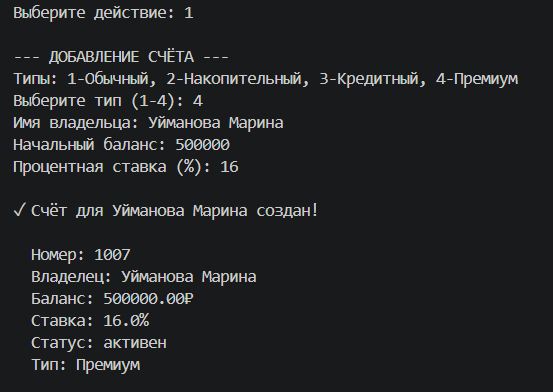
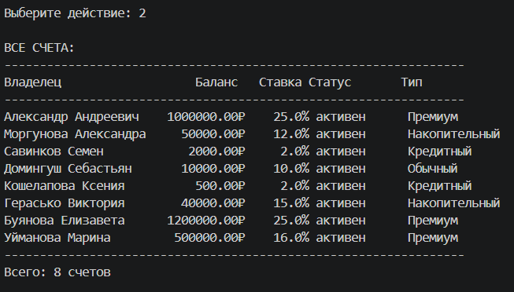
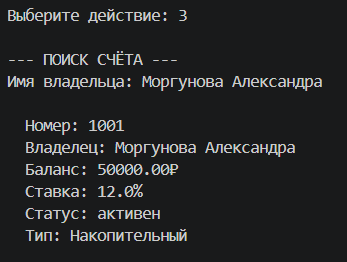
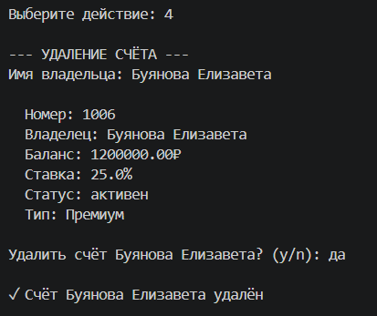
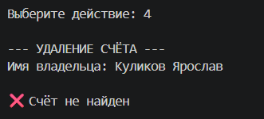
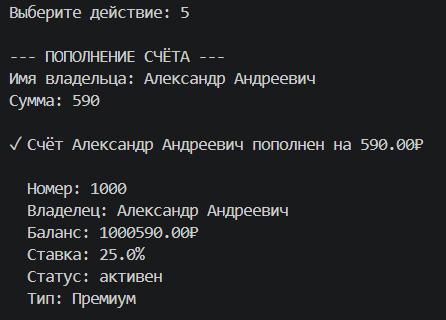
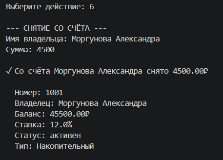
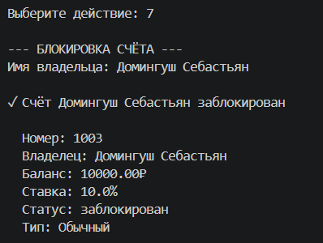
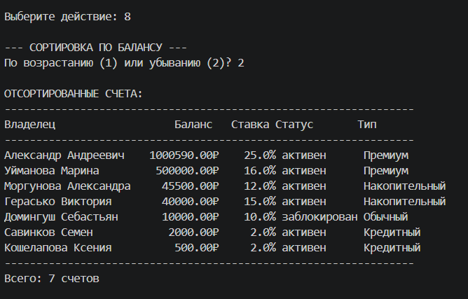
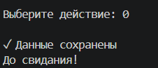

# Лабораторная работа №7 — Консольное приложение

## 1. Цель работы

Объединить все знания, полученные в ЛР1–ЛР6, в единое работающее приложение. Реализовать интерактивный CLI-интерфейс с меню и вводом пользователя.

**Применённые навыки:**
- Объектно-ориентированное программирование (классы BankAccount, SavingsAccount, CreditAccount, PremiumAccount)
- Работа с коллекциями (BankAccountCollection)
- Собственные исключения (AccountNotFoundError, DuplicateAccountError)
- Функции высшего порядка (сортировка)
- Аннотации типов (typing)
- Работа с JSON (сохранение/загрузка данных)
- Разделение на слои (CLI → бизнес-логика → хранение данных)

## 2. Структура проекта
```
python_labs/
│  ├─ lab07/
|  |   ├─data
            ├─accounts.json #Файл с сохранёнными счетами
│  │   ├─ README.md
│  │   ├─ main.py          # точка входа, запуск приложения
│  │   ├─ cli.py           # интерфейс: меню, ввод, вывод
│  │   ├─ app.py           # добавляет, удаляет, ищет счета и тд
│  │   ├─ exceptions.py    # исключения.счёт не найден,дубликат счёта
│  │   └─ storage.py       # сохранение/загрузка данных
```

## 3. Описание CLI

### 3.1 Пункты меню

| Пункт | Описание |
|-------|----------|
| 1 | Добавление нового счёта (выбор типа: 1-Обычный, 2-Накопительный, 3-Кредитный, 4-Премиум) |
| 2 | Показать все счета (вывод в виде форматированной таблицы) |
| 3 | Найти счёт по имени владельца |
| 4 | Удалить счёт (с подтверждением y/n) |
| 5 | Пополнить счёт |
| 6 | Снять средства со счёта |
| 7 | Заблокировать счёт |
| 8 | Сортировка по балансу (возрастание/убывание) |
| 0 | Выход (автосохранение) |

### 3.2 Обработка ошибок ввода

- Неверный пункт меню → "❌ Неверный пункт!"
- Ввод строки вместо числа → "Ошибка: введите число"
- Отрицательная сумма → "Ошибка: не может быть меньше 0"
- Снятие больше баланса → "❌ Недостаточно средств"
- Удаление несуществующего счёта → "❌ Счёт для X не найден"
- Добавление дубликата → "❌ Счёт для X уже существует!"

### 3.3 Сохранение/загрузка данных

- При запуске: автоматическая загрузка из `data/accounts.json`
- При выходе: автоматическое сохранение в `data/accounts.json`
- Папка `data` и файл создаются автоматически при первом сохранении
- Формат данных: JSON (сохраняется тип счёта, владелец, баланс, ставка, статус, номер)

## 4. Демонстрация работы

### Сценарий 1: Добавление счёта



**Что демонстрируется:** Создание нового банковского счёта с выбором типа, вводом имени владельца, баланса и процентной ставки.


### Сценарий 2: Просмотр всех счетов 



**Что демонстрируется:** Вывод всех счетов в виде форматированной таблицы с колонками: Владелец, Баланс, Ставка, Статус, Тип.


### Сценарий 3: Поиск счёта



**Что демонстрируется:** Поиск счёта по имени владельца. Выводится полная информация о найденном счёте.

**Вывод программы (счёт найден):**


### Сценарий 4: Пополнение счёта

**Что демонстрируется:** Пополнение счёта на указанную сумму. Баланс увеличивается, выводится обновлённая информация.
**Вывод программы (счёт найден):** 



**Вывод программы (счёт не найден):**



### Сценарий 5: Снятие средств



**Что демонстрируется:** Снятие средств со счёта. Баланс уменьшается. При попытке снять больше баланса выводится ошибка.


### Сценарий 6: Удаление счёта с подтверждением



**Что демонстрируется:** Удаление счёта с запросом подтверждения (y/n). Безопасное удаление с защитой от случайного нажатия.

**Вывод программы:**


### Сценарий 7: Сортировка по балансу



**Что демонстрируется:** Сортировка всех счетов по балансу. Пользователь выбирает порядок: по возрастанию (1) или убыванию (2).


### Сценарий 8: Блокировка счёта



**Что демонстрируется:** Блокировка счёта. После блокировки статус счёта меняется на "заблокирован".


### Сценарий 9: Сохранение и загрузка данных



**Что демонстрируется:** Автоматическая загрузка данных из JSON-файла при запуске и автоматическое сохранение при выходе.


## 5. Вывод

В ходе выполнения лабораторной работы были изучены и применены на практике следующие концепции:

### 5.1 Аннотации типов

Все функции и методы имеют аннотации типов. Параметры функций (owner: str, amount: float), возвращаемые значения (-> BankAccount, -> List[BankAccount], -> None), переменные (app: BankApp, accounts: list). Это позволяет IDE подсказывать типы и делает код самодокументируемым.

### 5.2 CLI-интерфейс

Реализовано интерактивное меню с 9 пунктами. Все действия выполняются в бесконечном цикле до выбора пункта "Выход". Обрабатываются следующие ошибки: неверный пункт меню, ввод строки вместо числа, отрицательная сумма, снятие больше баланса, удаление несуществующего счёта, добавление дубликата.

### 5.3 Обработка исключений

Созданы собственные исключения: `AccountNotFoundError` (счёт не найден), `DuplicateAccountError` (дубликат счёта). Используются встроенные исключения: `ValueError` (некорректная сумма операции), `Exception` (ошибки сохранения/загрузки).

### 5.4 Работа с файлами (оценка 5)

При запуске происходит автоматическая загрузка из `data/accounts.json`. При выходе — автоматическое сохранение в `data/accounts.json`. Папка `data` и файл создаются автоматически при первом сохранении. Формат данных сохраняет тип счёта, владельца, баланс, ставку, статус, номер.

### 5.5 Практическая польза

Разработанное приложение демонстрирует:
- Объектно-ориентированный подход (наследование BankAccount → SavingsAccount, CreditAccount, PremiumAccount)
- Работу с коллекциями (BankAccountCollection)
- Функции высшего порядка (сортировка через key-функцию)
- Работу с JSON (сохранение и загрузка)
- Полный цикл CRUD операций (Create, Read, Update, Delete)
