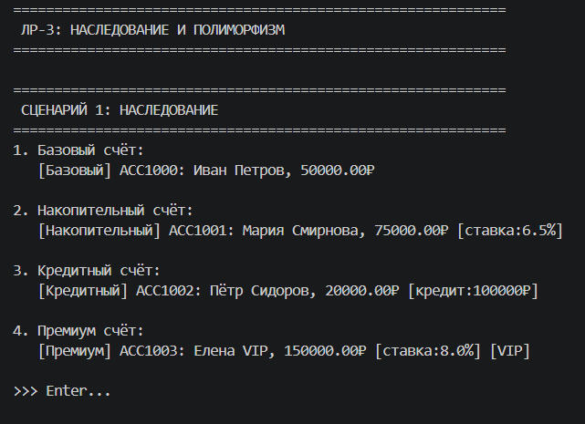
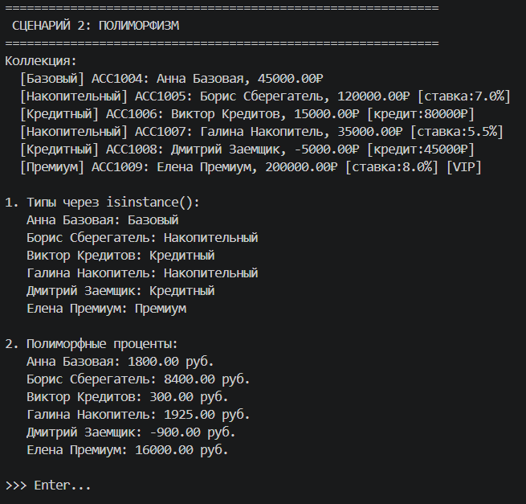
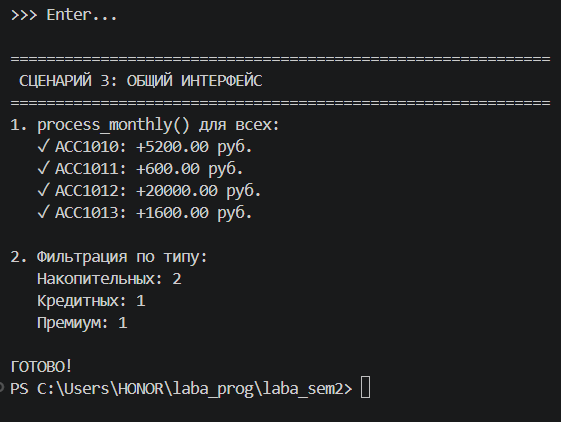

# Лабораторная работа №3 — Наследование и иерархия классов

## 1. Цель работы

Освоить механизм наследования классов, научиться строить иерархию объектов,
переиспользовать код и переопределять методы. Изучить полиморфизм и создание
общих интерфейсов для работы с разными типами объектов через базовый класс.

## 2. Описание реализованной иерархии классов

### Базовый класс `BankAccount`

Атрибуты:
- `_owner` — имя владельца
- `_balance` — текущий баланс
- `_rate` — процентная ставка
- `_number` — номер счёта
- `_status` — статус (активен/заблокирован/закрыт)

Методы:
- `deposit(amount)` — пополнение счёта
- `withdraw(amount)` — снятие средств
- `calculate_interest()` — расчёт процентов (полиморфный)
- `process_monthly()` — ежемесячная обработка (общий интерфейс)
- `get_type()` — возвращает тип счёта
- `block()`, `activate()` — управление статусом

### Дочерний класс `SavingsAccount` (Накопительный счёт)

**Новые атрибуты:**
- `_bonus` — бонусная надбавка к ставке
- `_limit` — лимит снятий в месяц
- `_withdrawals` — счётчик снятий

**Новые методы:**
- `add_bonus()` — начисление бонусных процентов
- `total_rate` — свойство, возвращает общую ставку (базовая + бонус)

**Переопределённые методы:**
- `withdraw()` — с проверкой лимита снятий
- `calculate_interest()` — с учётом бонусной ставки
- `__str__()` — отображает ставку

### Дочерний класс `CreditAccount` (Кредитный счёт)

**Новые атрибуты:**
- `_credit_limit` — кредитный лимит
- `_credit_rate` — ставка по кредиту
- `_credit_used` — использовано кредитных средств

**Новые методы:**
- `credit_available` — свойство, возвращает доступный кредит

**Переопределённые методы:**
- `withdraw()` — с возможностью ухода в минус
- `calculate_interest()` — на положительный остаток по базовой ставке, на отрицательный по кредитной
- `__str__()` — отображает кредитный лимит

### Дочерний класс `PremiumAccount` (Премиум счёт)

Наследуется от `SavingsAccount`, добавляет VIP-привилегии.

**Особенности:**
- Минимальный баланс при открытии — 100 000 ₽
- Увеличенная ставка и бонус

**Переопределённые методы:**
- `calculate_interest()` — дополнительный бонус 0.5% при балансе > 500 000 ₽
- `__str__()` — добавляет метку [VIP]

### Различия между классами

| Класс | Баланс | Ставка | Снятие | Особенности |
|-------|--------|--------|--------|-------------|
| BankAccount | ≥ 0 | базовая | без ограничений | базовый функционал |
| SavingsAccount | ≥ 0 | базовая + бонус | лимит в месяц | накопление с бонусом |
| CreditAccount | может быть < 0 | разная +/- | до кредитного лимита | возможность ухода в минус |
| PremiumAccount | ≥ 100 000 | повышенная | увеличенный лимит | VIP-привилегии |

## 3. Демонстрация работы

Демонстрация состоит из трёх сценариев в файле `demo.py`.

### Сценарий 1: Наследование

Создаются объекты всех четырёх типов счетов. Демонстрируется:
- Работа конструкторов с использованием `super()`
- Отображение объектов через переопределённый `__str__()`
- Различия в выводе для каждого типа счёта

### Сценарий 2: Полиморфизм

Создаётся коллекция `AccountCollection`, содержащая счета разных типов:
- Проверка типов через `isinstance()`
- Полиморфный вызов `calculate_interest()` — каждый тип считает проценты по-своему
- Демонстрация ухода кредитного счёта в минус

### Сценарий 3: Общий интерфейс

Демонстрация единого интерфейса для всех типов счетов:
- Вызов `process_monthly()` для всех счетов в коллекции
- Фильтрация коллекции по типу счёта (`get_by_type()`)
- Подсчёт количества счетов каждого типа
## 4. Вывод

В ходе выполнения лабораторной работы №3 были изучены:

### Наследование
- Создание иерархии классов: базовый класс `BankAccount` и дочерние `SavingsAccount`, `CreditAccount`, `PremiumAccount`
- Использование `super()` для вызова конструктора и методов базового класса
- Добавление новых атрибутов (`_bonus`, `_credit_limit`, `_credit_rate`)
- Добавление новых методов (`add_bonus()`, свойства `total_rate`, `credit_available`)
- Переиспользование кода — дочерние классы используют методы базового класса

### Полиморфизм
- Переопределение методов в дочерних классах:
  - `__str__()` — разное отображение для каждого типа счёта
  - `calculate_interest()` — разный расчёт процентов
  - `withdraw()` — разное поведение при снятии
  - `process_monthly()` — разная ежемесячная обработка
- Полиморфный вызов методов через базовый класс
- Работа с коллекцией объектов разных типов через единый интерфейс
- Проверка типов с помощью `isinstance()` для фильтрации
- Отсутствие условных конструкций вида `if type == ...` при вызове полиморфных методов
